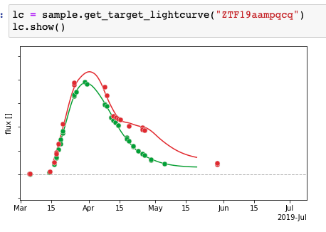

[](https://pypi.python.org/pypi/ztfidr)

# ztfidr
package to read and parse the ZTF SN IDR dataset

# Install
 `pip install ztfidr` [](https://pypi.python.org/pypi/ztfidr)
 or (for the latest implementations)
 ```bash
 git clone https://github.com/MickaelRigault/ztfidr.git
 cd ztfidr
 python setup.py install
 ```
**AND**
you need to have clone the [ZTF Interal datarelease](https://github.com/ZwickyTransientFacility/ztfcosmoidr) (password protected).

**you need to provide the fullpath as a global environment variable using: $ZTFIDRPATH**

# Usage

Assuming your `ztfcosmoidr/dr2` repository is stored at a location provided by `$ZTFIDRPATH`:
```python
import ztfidr
sample = ztfidr.get_sample() # UPDATE FOR YOUR CASE
```

The dataframe containing all the relevant information is accessible as `sample.data`:
```python
sample.data
```
and `sample.get_data()` you have many options like `x1_range`, `t0_range`, `redshift_range` or `goodcoverage=True`...

<p align="left">
  
</p>


To visualise an individual target lightcurve (e.g. `ZTF19aampqcq`), do:
```python
lc = sample.get_target_lightcurve("ZTF19aampqcq")
lc.show()
```
<p align="left">
  
</p>

***
# Host data

host data are accessible using `io.get_host_data()` that returns a multi-index columns dataframe. 
`host_data = io.get_host_data()`

the top-level columns are "2kpc", "4kpc" and "global".
If you want the dataframe only for the "global" data, simply do:

`global_host_data = host_data.xs("global", axis=1)` 

same for "2kpc" local

`local_host_data = host_data.xs("2kpc", axis=1)` 

The "Direct Light Ratio" (dlr) corresponding to effective distance from the host center is inside the "global" columns as `host_dlr`.
You can either access it as:

`dlr = global_host_data["host_dlr"]`

or directly from host_data as:

`dlr = host_data.xs("host_dlr", axis=1, level=1)`

*More functionalities are implemented, check ztfidr.get_hosts_data() etc.*
